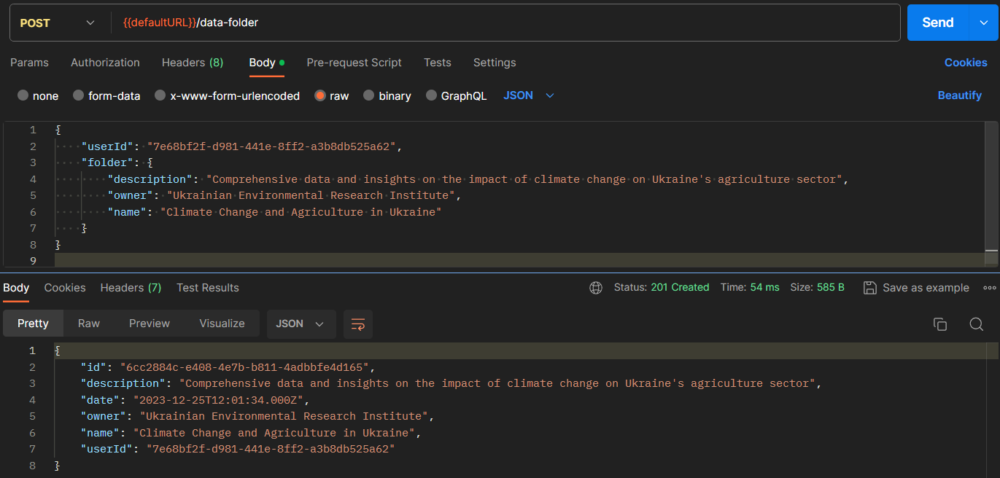

# Тестування працездатності системи

_В цьому розділі необхідно вказати засоби тестування, навести вихідні коди тестів та результати тестування._

Початковий стан бази даних.

## User

### Створення

### Отримання усіх користувачів

### Отримання користувача

### Зміна даних користувача

### Видалення користувача

## Data folder

### Отримання усі теки з даними

### Створення

### Отримання теки з даними

### Зміна теки з даними

### Видалення теки з даними

